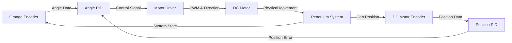

# Single Inverted Pendulum

This repository contains the code and documentation for an implementation of a self-balancing inverted pendulum using dual PID control loops for position and angle stabilization. This project demonstrates precise motion control through Arduino, combining mechanical engineering and control systems principles.

## Overview
This system maintains a pendulum in an upright position using cascaded PID controllers:
- Inner loop (Angle Control): A PID controller balances the pendulum at the upright position.
- Outer loop (Position control): A second PID controller moves the cart along the rail to maintain balance as the pendulum shifts position.

The system achieves stability through real-time angle measurements and position corrections, implemented on an Arduino Uno platform. Currently, the angle part is fully tuned and stable, with the position control still in progress.


## Components Used

Here’s a list of components used in this project:

- Linear Rail (1m): Provides linear motion for the cart on which the pendulum is mounted.
- DC Motor with Encoder: Used for precise position feedback and control of the cart's movement along the rail.
- Cytron MDDS30 Motor Driver: A versatile motor driver used to control the DC motor. It interfaces with the Arduino to drive the motor based on PID control signals.
- Orange Encoder: Provides accurate angle readings for the pendulum.
- 3D Printed Parts: Custom-designed parts for the cart, motor mount, pulley mount, and link. These parts help in assembling the system with high precision.
- Arduino Uno: The microcontroller that processes sensor data and implements the PID control loops.

## Required Arduino Libraries
```bash

```
## System Architecture


## Usage

1. Upload the Arduino code (.ino file) to your board:


2. Monitor system performance using Serial Plotter:
   - Open Arduino IDE
   - Select Tools > Serial Plotter
   - Monitor angle and position data in real-time

## Contributors
I would like to thank Palaash, Rohan, Vachan, Ketaki, and Vivan for being an incredible team!
## Acknowledgements
A big thank you to my seniors, Ritwik, Vimarsh, and Parth, for their guidance and occasional assistance with this project. Ritwik, PID tuning wouldn’t have been possible without your support. Vimarsh, your wild ideas have inspired some exciting possibilities for the future, and Parth, your help in setting up the motor driver was invaluable.

